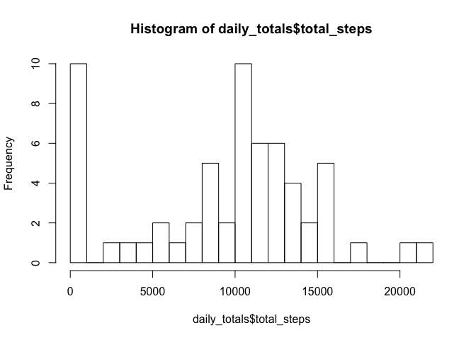
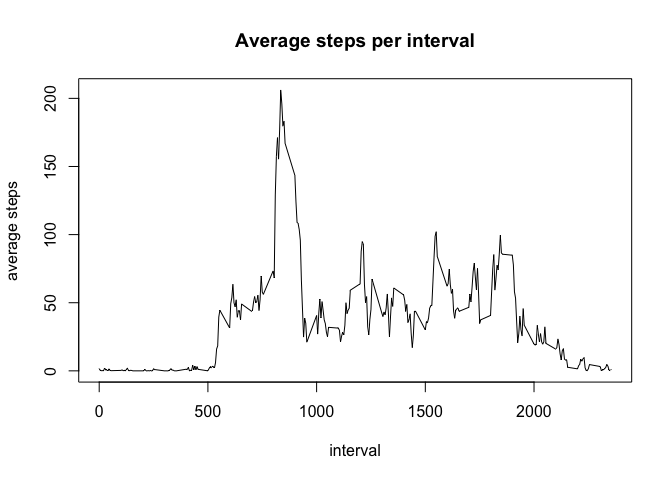
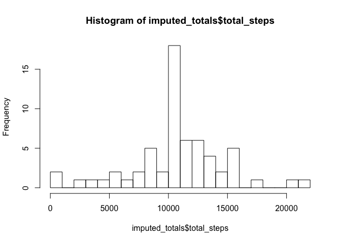
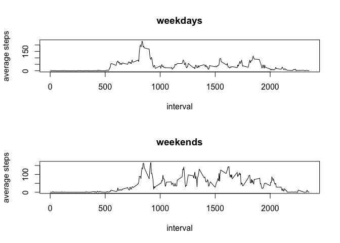

# Reproducible Research: Peer Assessment 1


## Loading and preprocessing the data

```r
library(data.table)
data <- data.table(read.csv("activity.csv",
                            colClasses = c("numeric", "Date", "numeric")))
```


## What is mean total number of steps taken per day?


```r
daily_totals <- data[ , sum(steps, na.rm=TRUE), by=date]
setnames(daily_totals, "V1", "total_steps")

hist(daily_totals$total_steps, breaks=20)
```

 

```r
mean(daily_totals$total_steps)
```

```
## [1] 9354.23
```

```r
median(daily_totals$total_steps)
```

```
## [1] 10395
```


## What is the average daily activity pattern?


```r
daily_pattern <- data[ , mean(steps, na.rm=TRUE), by=interval]
setnames(daily_pattern, "V1", "mean_steps")
```


Make a time series plot  of the 5-minute interval (x-axis) and the average number of steps taken, averaged across all days (y-axis).

```r
with(daily_pattern,
    plot(interval, mean_steps, type="l",
         ylab = "average steps",
         main = "Average steps per interval"))
```

 

Which 5-minute interval, on average across all the days in the dataset, contains the maximum number of steps?

```r
max_index <- which.max(daily_pattern$mean_steps)
daily_pattern[max_index, ]
```

```
##    interval mean_steps
## 1:      835   206.1698
```


## Imputing missing values

Up until now we have simply ignored missing values, by using `na.rm = TRUE`. 
What effect do these missing values have on the data analysis?

Frst off, how many missing values are there?


```r
sum(is.na(data$steps))
```

```
## [1] 2304
```

We will use the average (mean) of an interval across the whole data set to stand in for
data missing at a particular interval.


```r
imputed_data <- data

for( i in 1:nrow(data)) {
    if(is.na(data[i]$steps)) {
        imputed_data[i]$steps <- subset(daily_pattern, interval == data[i]$interval, mean_steps)$mean_steps
    }    
}

imputed_totals <- imputed_data[ , sum(steps), by=date]
setnames(imputed_totals, "V1", "total_steps")

hist(imputed_totals$total_steps, breaks=20)
```

 

```r
mean(imputed_totals$total_steps)
```

```
## [1] 10766.19
```

```r
median(imputed_totals$total_steps)
```

```
## [1] 10766.19
```

With the imputed data we get different values for mean and median and these values have both increased. This makes sense beacuse we have added steps that weren't being included at all.

## Are there differences in activity patterns between weekdays and weekends?


```r
imputed_data$weekday <- weekdays(imputed_data$date)

dayType <- function(x) { 
    if(x == "Sunday" || x == "Saturday") { 
        return("weekend") 
    } else { 
        return("weekday") 
    }
}
imputed_data$day_factor <- factor(sapply(imputed_data$weekday, dayType))

weekday_data <- subset(imputed_data, weekday != "Saturday" & weekday != "Sunday")
weekend_data <- subset(imputed_data, weekday == "Saturday" | weekday == "Sunday")

weekday_pattern <- weekday_data[ , mean(steps), by=interval]
setnames(weekday_pattern, "V1", "mean_steps")

weekend_pattern <- weekend_data[ , mean(steps), by=interval]
setnames(weekend_pattern, "V1", "mean_steps")

par(mfrow=c(2,1))

with(weekday_pattern,
    plot(interval, mean_steps, type="l",
         ylab = "average steps",
         main = "weekdays"))

with(weekend_pattern,
    plot(interval, mean_steps, type="l",
         ylab = "average steps",
         main = "weekends"))
```

 
Note that the assignement asks us to compute a wekeend/weekday factor but then says we can use whatever
plotting method we like. My plotting method does not use the factor, but I computed it anyway.
